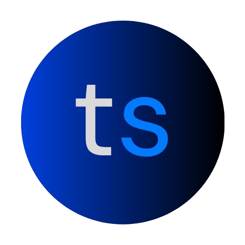

  

## 🚦 TransportSense – AI in Action Hackathon

[**TransportSense**](https://transportsense.xyz) is an interactive AI-powered, data-driven traffic simulation designed to educate users—particularly those unfamiliar with the complex realities of urban traffic—about the unintended consequences of road expansions and infrastructure decisions. By enabling users to add or remove roads and observe real-time changes in travel time, fuel consumption, and congestion costs, the simulator sheds light on counterintuitive phenomena like **Braess’ Paradox**.

Unlike traditional traffic simulators, TransportSense makes _complex traffic issues_ like Braess' Paradox _understandable to the public_ through real-time, data-powered visualizations and AI explanations. This is especially critical for policymakers, urban planners, and everyday citizens who may intuitively support road expansions without realizing that such decisions often worsen traffic and increase environmental harm. By guiding users through simulated scenarios, **TransportSense** aims to foster more informed public discourse and promote smarter investment in sustainable transit solutions.

By democratizing access to advanced traffic modeling and AI explanations, **TransportSense** empowers individuals and communities to make more informed choices—leading to urban policies that reduce congestion, curb greenhouse gas emissions, promote public transit, and build more livable, sustainable cities for all.

### 🛠️ Tech + Tools Used

**Google Cloud:**

- **Vertex AI + Gemini 2.0 Flash** – Guides the user step-by-step to help them fix a highly congested portion of Washington, D.C, generating natural-language explanations of traffic changes, and teaching users about real-world traffic dynamics like **Braess' Paradox** and **induced demand**.
- **Cloud Run** – hosts our **NextJS app** as a scalable containerized web app

**MongoDB Atlas:**

- Stores real-world transportation data sourced from the following public dataset and report:
  - [Transportation For America: The Congestion Con (we store Table I from the report)](https://t4america.org/wp-content/uploads/2020/03/Congestion-Report-2020-FINAL.pdf)
  - [Texas A&M Transportation Institute: Base Statistics from the 2023 Urban Mobility Report](https://mobility.tamu.edu/umr/report/)
- We use the data for Washington, D.C. from both data sources to calculate and persist updated traffic metrics based on the user actions (adding/removing roads) and our dynamic traffic simulation. These are the main metrics we track:
  - Average delay per mile
  - Average travel time per mile
  - Annual excess fuel wasted
  - Annual congestion cost
- We created embeddings and used **MongoDB Atlas' Vector Search** to help us find and compare similar traffic patterns.

Through its powerful simulation and data-driven insights, TransportSense is more than just an educational tool—it’s a blueprint for better public policy. It demonstrates how technology can help us combat urban inefficiencies, reduce transportation-related emissions, and reallocate public funds toward solutions that deliver long-term, equitable benefits for cities and the environment.

### 🔗 Submission Links

- **Live App**: [Check out TransportSense](https://transportsense.xyz)
- **Devpost**: [Our submission to the AI in Action Hackathon](https://devpost.com/software/transportsense)
- **Demo Video**: [See our demo video](https://www.youtube.com/watch?v=sk7Vp4eyMA4)
